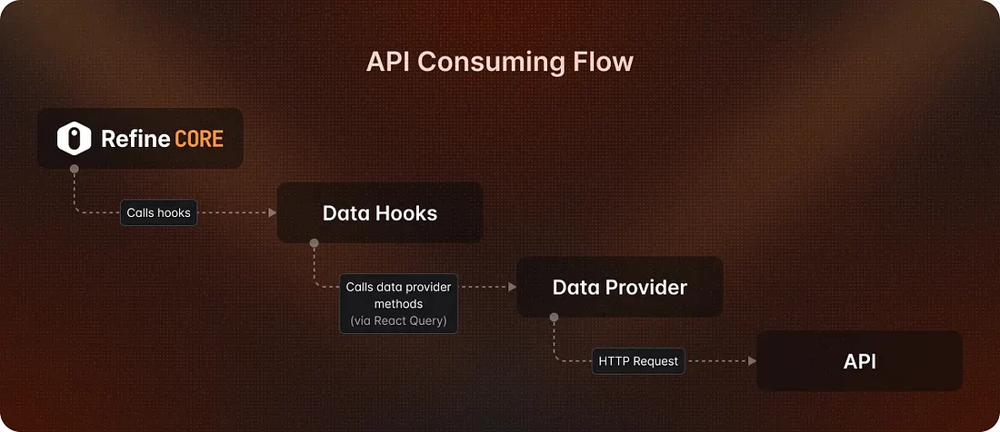
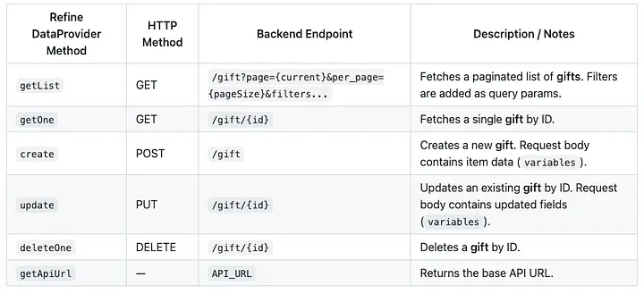

### **Project Requirements**

* CRUD operations with Many to Many mapping. (Outlets and Gifts)
* Probabilistic Gift Selection Algorithm + Spinning Wheel UI
* Automatic user generation + Multi outlet wise login
* Login and Secure Auth with separate admin view of all the information.

**Quick overview on Tech Stack and Architecture**\




## We utilized the power of the Refine framework to build this application. Refine was created to solve the overhead of building the same CRUD interfaces repeatedly.

Refine can be used with both React and Next.js. We can choose the UI library and few other options in the initiation of the project. For this particular project we utilized **Shadcn UI, Tailwind CSS and Jotai** state management.

### **What is Refine ? How it simplifies the Front End Logic and UI ?**

Think of Refine as a pre-built CRUD application that you can integrate and customize for your business requirements. You can connect your backend services, build authentication providers, and it works seamlessly. It offers great flexibility within the React ecosystem. Our team had experience with Shadcn, Tailwind, and Jotai, and we were able to use them easily with Refine.

### **Features of Refine**

* Auto-generation of CRUD UIs based on your API data structures
* Perfect state management and mutations with React Query
* Providers for seamless authentication and access control flows

Out-of-the-box support for live / real-time applications\
\


### **How to Configure Refine Framework to your business requirement**

Following code is a sample data provider that seamlessly integrate our back end API into the front end data. Methods inside this provider will work as translators between them.

### **Refine Architecture**


* **Refine CORE ( The “View” Layer)**

This represents your UI components (tables, forms, lists) built with Refine. When a user interacts with the UI the Core component doesn’t fetch data directly. Instead, it **calls a hook**.

* **Data Hooks (The State Management Layer)**

These are Refine’s custom hooks (like `useList`, `useOne`, `useUpdate`). Refine wraps React Query so you don’t have to manually configure it for every request. The hook prepares the request and send it to next layer.

* **Data Provider (The Adapter Layer)**

This is the most critical architectural component. It serves as a **bridge** or **translator**. Refine is backend-agnostic. It doesn’t know if your backend is a standard REST API, GraphQL, Supabase, or Firebase. The Data Provider takes the generic request from the Hook and translates it into the specific **HTTP Request.**

* **API (The Backend)**

Your actual server or database interface. It receives the standard HTTP request, processes it, and returns the JSON data back up the chain.

### **Inside a Data Provider: The Actual Code**

```
import { DataProvider } from "@refinedev/core";
import { axiosInstance } from "@/lib/axios"; // Your configured axios
import { API_URL } from "./constants";

export const dataProvider: DataProvider = {
  // 1. Get List: Fetches a list of items with pagination and filters
  getList: async ({ resource, pagination, filters }) => {
    const params = new URLSearchParams();

    // Handle Pagination
    if (pagination) {
      params.append("page", String(pagination.current));
      params.append("per_page", String(pagination.pageSize));
    }

    // Handle Filters (Simple equals check)
    filters?.forEach((filter) => {
      if ("field" in filter && filter.operator === "eq") {
        params.append(filter.field, String(filter.value));
      }
    });

    const { data } = await axiosInstance.get(`${API_URL}/${resource}?${params.toString()}`);

    return {
      data: data.data,
      total: data.total,
    };
  },

  // 2. Get One: Fetches a single item by ID
  getOne: async ({ resource, id }) => {
    const { data } = await axiosInstance.get(`${API_URL}/${resource}/${id}`);
    return { data: data.data };
  },

  // 3. Create: Creates a new item
  create: async ({ resource, variables }) => {
    const { data } = await axiosInstance.post(`${API_URL}/${resource}`, variables);
    return { data: data.data };
  },

  // 4. Update: Updates an existing item
  update: async ({ resource, id, variables }) => {
    const { data } = await axiosInstance.put(`${API_URL}/${resource}/${id}`, variables);
    return { data: data.data };
  },

  // 5. Delete: Deletes an item
  deleteOne: async ({ resource, id }) => {
    const { data } = await axiosInstance.delete(`${API_URL}/${resource}/${id}`);
    return { data: data.data };
  },

  getApiUrl: () => API_URL,
};

```



### **Access Control: Show or Hide UI by Role**

```
const ACCESS_DENY_MAP: Record<string, Record<string, DenyRule>> = {
  super_admin: {
    "spin-wheel": {
      can: false,
      reason: "Super Admins cannot access the Spin Wheel",
    },
  },
  outlet_admin: {
    "outlets:list": {
      can: false,
      reason: "Outlet Admins cannot access this resource",
    },
  },
};

export const accessControlProvider: AccessControlProvider = {
  can: async ({ resource, action }): Promise<CanReturnType> => {
    const userRole = localStorage.getItem(USER_TYPE_KEY);
    const roleRules = userRole ? ACCESS_DENY_MAP[userRole] : undefined;

    if (roleRules && resource != null) {
      const resourceDeny = roleRules[resource];
      if (resourceDeny) return resourceDeny;

      if (action != null) {
        const actionKey = `${resource}:${action}`;
        const actionDeny = roleRules[actionKey];
        if (actionDeny) return actionDeny;
      }
    }

    return { can: true };
  },
};


// APP.tsx (injecting the providers) 

    <Refine
      dataProvider={dataProvider}
      notificationProvider={useNotificationProvider()}
      routerProvider={routerProvider}
      authProvider={authProvider}
      accessControlProvider={accessControlProvider}
      resources={resources}
      options={{
        syncWithLocation: true,
        warnWhenUnsavedChanges: true,
        projectId: "aGc8b6-n8GqQk-zhQYV5",
        title: {
          icon: <Logo className="w-8 h-8" />,
          text: "Sample",
        },
      }}
    >
```

## **Back end Architecture — Hono**

Hono is a fast express like web application framework. But is minimal and Ultra Fast. It can be easily deployed into Cloudflare workers or AWS lambda. If you deploy it using Cloudflare workers you can deploy it for absolute zero cost for smaller applications.

We choose Hono because it perfectly matches our requirement. We need faster deployments hassle-free dev experience. Using a JS framework for the back end is ideal for our situation because our small dev brains do not need to context switch when we switch from front end to back end.

### **Database and Storage**

D1 is Cloudflare’s serverless database that works like SQLite. It automatically handles backups and can be accessed using Cloudflare Workers or HTTP APIs. It’s built to scale by letting you create many small databases (up to 10 GB each). For our requirement this 10 GB limit will never exceed. This was the best free option for us.

D1 offers an awesome developer experience with easier SQL based migrations and local database setup.

Cloudflare R2 is object storage for storing large files and unstructured data. We used R2 for storing images and other data files. Its 10 GB free offer is also enough for our requirement.

Both D1 and R2 seamlessly integrate with Hono framework giving us the best Dev Experience. This faster integrations allow building back end API faster within few days.

### **How Easy It Is to Integrate D1 & R2 with Hono**

```
# wrangler.toml

# Bind the D1 Database
[[d1_databases]]
binding = "MY_D1" # variable name you will use in your code
database_name = "my-database-name"
database_id = "your-database-id-here"

# Bind the R2 Bucket
[[r2_buckets]]
binding = "MY_R2" # variable name you will use in your code
bucket_name = "my-bucket-name"
```

```
// index.ts or types.ts
import { Hono } from 'hono'

// Define the Bindings interface
type Bindings = {
  MY_D1: D1Database;
  MY_R2: R2Bucket;
}

// Pass the Bindings type to the Hono instance
const app = new Hono<{ Bindings: Bindings }>()

export default app
```

> *Wrangler will emulate D1 and R2 locally, so you don’t need to connect to the production resources immediately.*

### **Philosophy of Shipping Great Products Fast**

> *“The real problem is that programmers have spent far too much time worrying about efficiency in the wrong places and at the wrong times; premature optimization is the root of all evil (or at least most of it) in programming.”*
>
> ***— Donald Knuth***

With an extremely tight timeline to deliver the product, we made one principle very clear from day one “**focus only on what truly matters”**. Instead of trying to build a perfect, over-polished system, we intentionally trimmed everything down to the absolute business essentials. We knew that if we obsessed over micro-optimizations or unnecessary complexity, shipping within the deadline would simply not be possible. Our entire team stayed hyper-focused on delivering real business value first, leaving minor refinements for later iterations.

Our team members were skilled in Java Spring Boot, FastAPI, and AWS. But if we had overengineered with Java and verbose code, this project couldn’t have been done this easily, and the deployments would have been a real pain.

We did not worry about deployments at all because our pipelines, which were handled using GitHub Actions, seamlessly integrated with Cloudflare, giving us faster deployment across dev and prod environments. This allows us to do critical changes to our application code easier and fast with the time we had for user acceptance testing.

*This did not mean being careless. Our philosophy was to mix the perfect amount of everything to balance the strict timeline with the best quality output possible.*\
\
Written with ❤️ for the dev community by [Epazingha](https://medium.com/u/a4e5f6cd55b1?source=post_page---user_mention--404d1ec61535---------------------------------------)
